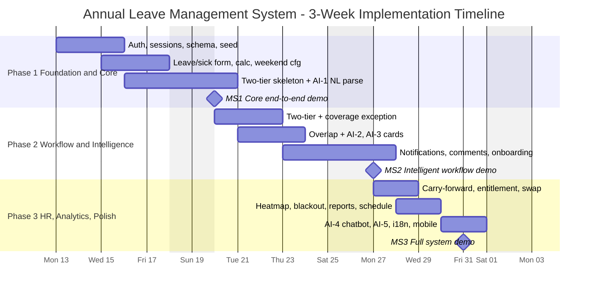

# Annual Leave Management System — Implementation Plan

> **Companion to:** the High-Level Design (AI-Enhanced, v3.0)
> **Stack:** React.js · Node.js · Express · PostgreSQL · Hosted LLM API
> **Team model:** 5 full-stack verticals (each member owns 6–7 use cases, frontend + backend)
> **Approach:** Core of every vertical first, then Enhanced (E) features · **Version:** 3.0

---

## Table of Contents

1. [Implementation Approach](#1-implementation-approach)
2. [Timeline](#2-timeline)
3. [Team & Ownership](#3-team--ownership)
4. [Cross-Cutting Contracts](#4-cross-cutting-contracts)
5. [Phase 1 — Foundation & Core Flow](#phase-1--foundation--core-flow)
6. [Phase 2 — Workflow Depth & Intelligence](#phase-2--workflow-depth--intelligence)
7. [Phase 3 — HR, Analytics & Enhanced Polish](#phase-3--hr-analytics--enhanced-polish)
8. [Milestones & Demo Checkpoints](#8-milestones--demo-checkpoints)
9. [Risk & Buffer Management](#9-risk--buffer-management)
10. [Definition of Done](#10-definition-of-done)

---

## 1. Implementation Approach

The build follows the source document's **three sequential phase-gates**. The rule is simple and strict: **build the Core of every vertical first** so there is always a working end-to-end system, then layer Enhanced (E) features. **Do not start a phase until the previous phase compiles and passes its tests.**

Because the team uses **full-stack verticals**, work *within* a phase runs in parallel — each of the five members advances both the frontend and the backend of their own area — while the *gates* between phases are shared checkpoints where everything must integrate and demo cleanly.

Each phase below lists:

- **Objective** — what the phase delivers
- **Depends on** — the prerequisite gate
- **Tasks by member** — concrete work, with (E) marking Enhanced features, referencing the HLD's use cases (UC-xx), endpoints, and services
- **Exit criteria** — the gate that must pass before the next phase

AI features are introduced deliberately by risk and demo value: **AI-1** (natural-language leave entry) lands first in Phase 1 as the highest-impact, lowest-risk integration; **AI-2** and **AI-3** add intelligence to the workflow in Phase 2; **AI-4** and **AI-5** complete the analytics story in Phase 3.

---

## 2. Timeline

### 2.1 Phase Summary

| Phase | Focus | Working Days | Calendar (2026) | Core AI |
|-------|-------|:------------:|-----------------|---------|
| **P1** | Foundation & core flow | Days 1–6 | Jul 13 – Jul 20 | AI-1 |
| **P2** | Workflow depth & intelligence | Days 6–11 | Jul 20 – Jul 27 | AI-2, AI-3 |
| **P3** | HR, analytics & enhanced polish | Days 11–15 | Jul 27 – Jul 31 | AI-4, AI-5 |

> Calendar dates are illustrative (three-week window starting Monday 13 July 2026, weekends excluded); shift the start date to match the actual sprint. Phase gates fall on Jul 20, Jul 27, and Jul 31.

### 2.2 Gantt View

---

## 3. Team & Ownership

Workload is balanced to **6 use cases per member** (Member 2 carries 7, since the core employee flow is the system's most-used path).

| Member | Vertical | Owns (use cases) | UC count |
|--------|----------|------------------|:--------:|
| **M1** | Platform, Identity & Self-Service | UC-09, UC-20, UC-23, UC-24, UC-25, UC-26 | 6 |
| **M2** | Employee Leave Experience | UC-01, UC-03, UC-05, UC-08 (staff), UC-13, UC-14, UC-27, AI-1 | 7 |
| **M3** | Approval, Delegation & Notification | UC-02, UC-08 (approver), UC-12, UC-15, UC-16, UC-28, AI-3 | 6 |
| **M4** | Coverage, Calendar & Scheduling-Rules | UC-06, UC-07, UC-17, UC-18, UC-19, UC-29, AI-2 | 6 |
| **M5** | HR Admin, Analytics & Automation | UC-04, UC-10, UC-11, UC-21, UC-22, UC-30, AI-4/AI-5 | 6 |

**Critical path:** M1's shared foundations (auth, RBAC, session management, database schema, responsive shell, deployment) gate everyone in Phase 1 — they must be stable early. M4's working-day/holiday-aware calculation, weekend config, and country policy engine are the second dependency, because M2 (balances, sick quotas) and M5 (carry-forward) build on them. M3's two-tier routing is the backbone of the approval demo. Enhanced features carry the most cumulative load on M2 (MC upload, forecast, `.ics`, leave swap) and M5 (analytics, both AI-4 and AI-5, scheduled reports) — mitigated by keeping them in Phase 3 and deferring individual (E) items if time runs short.

---

## 4. Cross-Cutting Contracts

These shared seams must be agreed **before Phase 1 coding** so the verticals integrate without rework:

- **Leave-duration calculation (M4)** is the single source of truth and reads the weekend-config table (UC-29). M2 (balance forecast, deduction, sick quotas) and M5 (carry-forward) **call it**, never re-implement it.
- **Country policy data (M4)** feeds carry-forward (M5) and sick-leave logic (M2). Fix the policy data contract (fields in `leave_policies` and `country_working_days`) on day one.
- **Team-calendar component (M4)** is a shared React component consumed by the employee view (M2) and the approver view (M3). Publish its props/API contract early.
- **RBAC layer (M1)** enforces UC-08 role visibility centrally; each member renders their own persona's calendar, history, and reports within those permissions.
- **Responsive shell + shared components (M1)** are consumed by all; every member makes their own screens responsive (UC-09).
- **Notification preferences (M1, UC-23)** are read by the notification service (M3, UC-12); settle the event-type list up front — comment-thread notifications (UC-28) reuse the same pattern.
- **Invitation → pro-ration handoff (M1)**: the onboarding flow (UC-24) triggers bulk-entitlement pro-ration logic (UC-20) on account activation; both are self-contained within M1, but the trigger contract should be settled early.
- **LLM adapter (`llmClient.js`)** is shared by all AI features; agree the provider and the `complete()` signature before AI-1 work begins.

---

## Phase 1 — Foundation & Core Flow

**Objective:** A running end-to-end system: a user can log in, apply for leave (manually or by typing it in natural language via AI-1), see correct balances and their country's holidays on a calendar, and have the request route through a two-tier approval skeleton that deducts balance only on final approval.

**Depends on:** Nothing (entry point).

### Tasks by member

**M1 — Platform, Identity & Self-Service**
- [ ] Initialise the monorepo (`frontend/` Vite + React + Tailwind, `backend/` Express) with the permitted dependencies and `.env.example`.
- [ ] `authMiddleware` (JWT verify) and `rbacMiddleware.requireRole(...)`; `POST /api/auth/login`, `GET /api/auth/me`; bcrypt hashing; `user_sessions` table + login/failed-attempt logging to `security_events` (UC-25 foundation).
- [ ] Database schema ownership: run `db/schema.sql` (all 23 tables, constraints, indexes) + migrations; seed policies (10 countries), leave types, and weekend config.
- [ ] Login page, role-based navigation shell, protected routing, shared component library, responsive layout framework (UC-09).
- [ ] Deployment / CI / environment configuration; provision PostgreSQL locally and on the cloud host.

**M2 — Employee Leave Experience**
- [ ] `POST /api/leave` (submit) and `GET /api/leave`, `GET /api/leave/:id`; balance not exceeded; half-day ⇒ single day.
- [ ] Leave application form (full/half-day AM-PM) + dashboard + personal calendar & history.
- [ ] Sick-leave form with MC/no-MC toggle (UC-05) and country-specific quota check.
- [ ] **AI-1**: `services/ai/parseLeave.js` (text → structured fields) + natural-language input box; employee confirms before submit.

**M3 — Approval, Delegation & Notification**
- [ ] Two-tier routing **state machine** (enforced Supervisor → Manager, no bypass); `PUT /api/approvals/:id/approve` and `/reject`.
- [ ] Balance deducted **only** on Manager final approval; every action writes `audit_log`.
- [ ] Basic approval queue UI (role-scoped).

**M4 — Coverage, Calendar & Scheduling-Rules**
- [ ] `calculationService.js` — working-day & holiday-aware duration (half-day = 0.5), reading the country weekend-config table rather than a hard-coded Sat/Sun. **Single source of truth.**
- [ ] `country_working_days` table + `weekendConfigService.js` — default Sat–Sun, HR-editable (UC-29 foundation).
- [ ] `policyService.js` — country entitlement/quota resolution.
- [ ] Public-holiday import from the provided 2026 Excel (`seedHolidays2026.js`); `GET /api/holidays`, `GET /api/calendar/team`; team calendar with holiday display.

**M5 — HR Admin, Analytics & Automation**
- [ ] Employee / policy / leave-type management API + a basic HR admin panel; CSV staff-import skeleton (`POST /api/admin/employees/import`).
- [ ] Seed multi-country test employees with reporting lines and starting balances.

### Exit criteria (gate)
- [ ] Valid login returns a JWT + user; missing/invalid token → 401; wrong role → 403; a session row is recorded.
- [ ] An employee applies (manually **or** via AI-1) → request persists as `PENDING`; a sick-leave request applies the correct MC/no-MC quota.
- [ ] `computed_days` excludes the country's configured non-working days and public holidays; half-day = 0.5.
- [ ] Request routes Supervisor → Manager; balance deducts **only** on final Manager approval.
- [ ] 2026 holidays and weekend config seeded; policies seeded for all 10 countries.
- [ ] Phase-1 test cases pass. **→ Milestone MS1 (core end-to-end demo).**

---

## Phase 2 — Workflow Depth & Intelligence

**Objective:** The approval workflow is complete and intelligent — overlaps are detected and explained (AI-2), each pending request carries an AI-3 summary card, the coverage-exception branch requires Manager special approval, notifications fire with reminders, and employees can cancel, save drafts, track status, and attach medical certificates.

**Depends on:** P1 (auth, core leave flow, two-tier skeleton, calculation).

### Tasks by member

**M4 — Coverage, Calendar & Scheduling-Rules**
- [ ] `coverageService.js` — overlap detection + coverage-threshold engine; `GET /api/calendar/coverage`.
- [ ] **AI-2**: `services/ai/coverageAnalyzer.js` — plain-English impact + suggested alternative dates (counts only sent to the LLM, no names); coverage warning banner + AI-2 panel.

**M3 — Approval, Delegation & Notification**
- [ ] Complete two-tier approval with the **coverage-exception** branch (special-approval flag → Manager must explicitly approve).
- [ ] **AI-3**: `services/ai/approvalSummary.js` — pattern + coverage + recommendation, cached in `leave_requests.ai_summary`; approval detail card.
- [ ] `notificationService.js` — email + in-app; triggers per UC-12; 24-hour pending reminder + escalation (reminder only, never auto-approves); `GET/PUT /api/notifications*`.
- [ ] Comment thread on requests (UC-28): append-only API + UI, locked once the request is decided; reuses the notification service for new-comment alerts.
- [ ] Bulk approve/reject with comments (E); delegation engine with auto-expiry + setup screen (E).

**M2 — Employee Leave Experience**
- [ ] Cancellation workflow (UC-03): pending → immediate; approved → routes through Supervisor → Manager, restoring balance on approval.
- [ ] Drafts (UC-14) + request status stepper; wire the AI-2 coverage warning into the apply flow.
- [ ] Medical-certificate upload UI + `POST /api/leave/:id/attachments` with secure, access-controlled storage (E); `.ics` export + balance forecast (E).

**M1 — Platform, Identity & Self-Service**
- [ ] New-employee invitation & onboarding flow (UC-24): invite form, single-use 48-hour token, registration + guided first-login tour; triggers pro-ration on activation.
- [ ] System announcements broadcast (UC-26): compose/target/schedule screen, banner/modal, mandatory-acknowledge blocking, read/ack count.
- [ ] Notification-preferences screen + `GET/PUT /api/preferences`; read by M3's notification service.

### Exit criteria (gate)
- [ ] An overlapping request is flagged and AI-2 explains the impact and suggests an alternative range.
- [ ] Each pending request shows an AI-3 summary card to the approver.
- [ ] Coverage below threshold routes as a special-approval exception the Manager must explicitly approve.
- [ ] Notifications appear in-app and by email at each step; a 24-hour reminder fires without auto-approving.
- [ ] A comment posted on a pending request notifies the other party and locks once the request is decided.
- [ ] Cancellation, drafts, status tracker, and MC upload (E) all work; delegation and bulk approval (E) work.
- [ ] HR sends an invite; the new employee registers via the token and sees an auto-computed, pro-rated entitlement.
- [ ] A mandatory-acknowledge announcement blocks navigation until confirmed; a dismissible one does not.
- [ ] Phase-2 test cases pass. **→ Milestone MS2 (intelligent workflow demo).**

---

## Phase 3 — HR, Analytics & Enhanced Polish

**Objective:** HR automation and analytics complete the system — the year-end carry-forward runs (5-day cap), entitlements can be bulk-assigned with pro-ration, blackout periods and the manpower heatmap are live, reports export, the audit viewer works, and the AI-4 chatbot and AI-5 anomaly flags round out the AI story. Everything is polished for mobile and rehearsed.

**Depends on:** P2 (complete workflow, coverage engine, notifications) and P1 (policy + calculation).

### Tasks by member

**M5 — HR Admin, Analytics & Automation**
- [ ] `carryForwardService.js` + `jobs/yearEndJob.js` (node-cron, Dec 31 23:59 **SGT**): compute unused, cap at 5, forfeit + log, reset entitlement, summary to Employee + HR; `POST /api/admin/carry-forward/trigger` for the live demo.
- [ ] Reporting suite + Excel/PDF export (E); audit-trail viewer (read-only) (E).
- [ ] Scheduled & automated report delivery (UC-30, E): `report_schedules` table, cron dispatch, retry-once-then-notify on failure, management screen.
- [ ] **AI-4**: `queryCatalogue.js` (fixed parameterised queries) + chatbot UI — classify question, extract params, run pre-defined query, **no free SQL**. **AI-5**: `anomalyDetector.js` — forfeiture-risk, coverage gaps, clustering, burnout flags on the HR dashboard (E).

**M1 — Platform, Identity & Self-Service**
- [ ] Bulk yearly entitlement update + new-joiner **pro-ration** with preview-then-commit (UC-20, E).
- [ ] Localisation / i18n resource backend + locale switcher (E); finalise self-service profile & password change; responsive-shell polish.

**M4 — Coverage, Calendar & Scheduling-Rules**
- [ ] Blackout periods (BLOCK / SPECIAL_APPROVAL) + minimum-staffing rules + manpower heatmap (green/amber/red) (E).
- [ ] Online holiday-calendar sync as an alternative to CSV import (E).

**M2 — Employee Leave Experience**
- [ ] Leave swap request (UC-27, E): proposal + incoming-swap inbox, 48-hour expiry, paired atomic approval, balances unaffected.

**All — Integration, mobile & demo**
- [ ] Make every vertical's screens responsive (UC-09); end-to-end integration testing; standardise error envelopes.
- [ ] Seed a clean demo dataset (multi-country staff, overlapping requests, a near-cap balance, an understaffed day, a blackout window, a pair of swap-eligible requests).
- [ ] Rehearse the twelve key demo points (Section 8).

### Exit criteria (gate)
- [ ] Manual carry-forward trigger caps unused at 5, forfeits the rest, resets entitlement, writes an audit row, and sends the summary.
- [ ] Manpower heatmap reveals a red (understaffed) day; a blackout period blocks or flags new leave per its mode.
- [ ] Reports export to Excel/PDF; the audit viewer is read-only and filterable; a scheduled report delivers to its recipient list at the configured time.
- [ ] AI-4 chatbot answers via the fixed query catalogue (never free SQL) and falls back gracefully; AI-5 flags appear on the HR dashboard.
- [ ] Two employees complete a leave swap end-to-end through the two-tier chain with balances unchanged.
- [ ] i18n, `.ics` export, bulk entitlement/pro-ration, and notification preferences (E) all work; all use cases are demonstrable on a mobile browser.
- [ ] No open P0/P1 bugs; all test cases pass; demo rehearsed. **→ Milestone MS3 (full system demo).**

---

## 8. Milestones & Demo Checkpoints

| ID | Milestone | After | Target (2026) | What it proves |
|----|-----------|:-----:|---------------|----------------|
| **MS1** | Core end-to-end demo | P1 | Jul 20 | Login → apply (incl. AI-1, sick leave) → correct balances & holidays → two-tier skeleton |
| **MS2** | Intelligent workflow demo | P2 | Jul 27 | Overlap + AI-2, AI-3 cards, comment thread, notifications, MC/drafts/delegation, onboarding, announcements |
| **MS3** | Full system demo | P3 | Jul 31 | Carry-forward, heatmap/blackout, leave swap, reports/audit/scheduled delivery, AI-4/AI-5, mobile-ready, rehearsed |

**The twelve demo points** (source §9), mapped to milestones:

1. **Calendar format** — team leave and country-specific public holidays (MS1).
2. **Overlap prevention** — two team members applying for the same dates; AI-2 explains why and suggests alternatives (MS2).
3. **Two-tier approval flow** (Supervisor → Manager) with AI-3 assistant cards and comment thread — pitched as cutting approval from "a week" toward same-day decisions (MS2).
4. **Approval delegation** — a supervisor goes on leave and a deputy seamlessly handles approvals (MS2).
5. **Manpower heatmap** — reveal a red (understaffed) day and show a blackout period blocking new leave (MS3).
6. **Leave swap** — two employees swap approved leave dates end-to-end through the approval chain (MS3).
7. **Year-end carry-forward** — trigger the batch job live; show the 5-day cap in action (MS3).
8. **Multi-country policy** — switch between Singapore and Thailand employees to show different rules, holiday sets, and sick-leave quotas (MS1/MS3).
9. **Onboarding flow** — HR sends an invite; the new employee registers and sees entitlement auto-computed (MS2).
10. **AI-1 natural-language input** — type "I need next Monday off" and watch the form auto-fill (MS1).
11. **AI-4 HR chatbot + AI-5 flags** — ask "Which country has the most pending requests?" and show a "leave about to be forfeited" alert (MS3).
12. **Mobile responsiveness** — pull out a phone and walk through an application (MS3).

---

## 9. Risk & Buffer Management

| Risk | Likelihood | Impact | Mitigation |
|------|:----------:|:------:|------------|
| Shared foundations (M1) slip and block everyone | Medium | High | Front-load auth/RBAC/schema in the first two days of P1; freeze the JSON contracts early. |
| LLM integration is flaky or slow | Medium | Medium | Provider adapter with a stub fallback; AI outputs are advisory, so the app works if the LLM is down; keep AI-1 (simplest) first. |
| AI-4 prompt-injection / data leakage | Low | High | Fixed query catalogue only — never model-generated SQL; no raw PII sent; log every call to `ai_interactions`. |
| M2 and M5 carry the most Enhanced features (M2: MC upload, forecast, `.ics`, leave swap; M5: analytics, AI-4/AI-5, scheduled reports) | High | Medium | All in P3 and all marked (E); defer leave swap, AI-5, reporting exports, or scheduled delivery individually if time runs short without touching Core. |
| Duplicated leave-duration logic drifts | Medium | Medium | Single `calculationService` owned by M4, reading the shared weekend-config table; M2 and M5 call it; unit-test cross-holiday and cross-weekend spans in P1. |
| Mobile layout breaks late | Medium | Medium | Responsive Tailwind shell from P1; every member owns their screens' responsiveness; dedicated polish pass in P3. |
| Leave-swap atomic update fails partially | Low | Medium | Wrap the paired `leave_requests` update in a single DB transaction; roll back fully on any error so the two entries never diverge. |

**Buffer:** Enhanced (E) features are the release valve — the Core of every vertical is built first, so the team can drop individual (E) items in Phase 3 and still demo a complete, working system. Treat the final morning as a code freeze; the afternoon is demo rehearsal only.

---

## 10. Definition of Done

A feature is **done** only when all of the following hold:

- [ ] It satisfies its use case (UC-xx) and the HLD's data contract (request/response shape, status codes).
- [ ] It works on both desktop and mobile browsers.
- [ ] RBAC is enforced server-side; unauthorised roles receive 403, and data visibility follows the Section 7 matrix.
- [ ] Every state-changing action writes an `audit_log` row.
- [ ] Any AI output is advisory only; balance math, approval routing, and coverage thresholds are decided in code.
- [ ] API responses use the standard success/error envelope from the HLD.
- [ ] Its happy-path **and** edge-case test cases pass.
- [ ] It is merged to the shared branch and the branch still builds and runs.
- [ ] No open P0/P1 defects.

---

*End of Implementation Plan*
