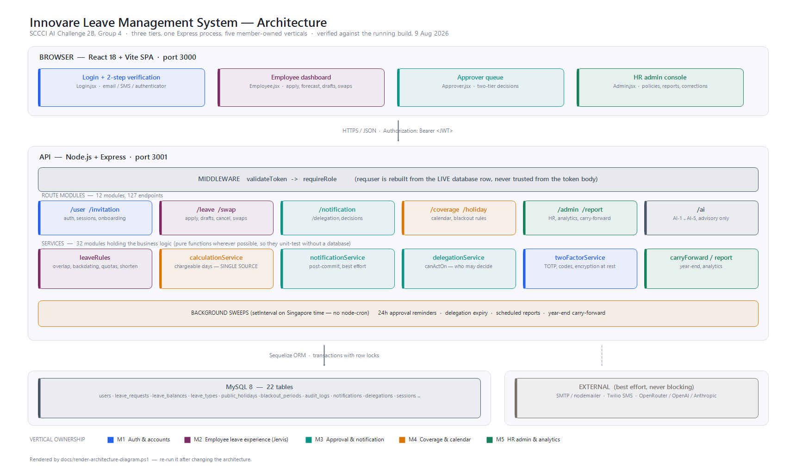

# Innovare Leave Management System

**SCCCI AI Challenge 2B · Group 4**
A multi-country annual-leave system for an SME: apply, approve through two tiers,
track coverage, and administer policy — with five AI features that all degrade
cleanly when no AI provider is configured.

| | |
|---|---|
| **Live URL** | https://innovare-leave-client.vercel.app (API: https://innovare-leave.vercel.app) |
| **Stack** | React 18 + Vite · Node.js + Express · MySQL 8 (Sequelize) |
| **Tests** | 413 across 30 suites, all passing |
| **API** | 130 endpoints across 12 route modules |
| **Docs** | [`docs/architecture.md`](docs/architecture.md) · [`HLD`](HLD_LeaveManagementSystem_3.md) · [`Use cases`](Leave_Management_System_UseCases_and_TaskAllocation_4.md) |



---

## Contents

- [Prerequisites](#prerequisites)
- [Setup — run it locally](#setup--run-it-locally)
- [Demo accounts](#demo-accounts)
- [Signing in (2FA)](#signing-in-2fa)
- [Running the tests](#running-the-tests)
- [Deployment](#deployment)
- [Guided demo](#guided-demo)
- [Project layout](#project-layout)
- [Team & ownership](#team--ownership)
- [Troubleshooting](#troubleshooting)

---

## Prerequisites

| Requirement | Notes |
|---|---|
| **Node.js 18+** | 20 LTS or newer recommended |
| **MySQL 8** | Running locally, with a user that can create databases |
| npm | Ships with Node |

No AI key, SMTP server or SMS account is required. Without them the app still runs
end to end — AI features fall back to deterministic logic, and verification codes
are shown on screen instead of being emailed.

---

## Setup — run it locally

### 1. Create the databases

```sql
CREATE DATABASE `leave`;
CREATE DATABASE `leave_test`;
```

Tables are created automatically on first start (`sequelize.sync({ alter: true })`) —
there is no migration step.

### 2. Configure the server

```bash
cd server
npm install
cp .env.example .env
```

Then edit `server/.env`. The minimum you must set:

| Variable | Example | Why |
|---|---|---|
| `DB_HOST` / `DB_PORT` | `localhost` / `3306` | MySQL connection |
| `DB_USER` / `DB_PWD` | your MySQL user | Use a limited user, not root, if you can |
| `DB_NAME` | `leave` | The demo database |
| `APP_SECRET` | any long random string | Signs JWTs — **the server refuses to start without it** |
| `APP_PORT` | `3001` | API port |
| `CLIENT_URL` | `http://localhost:3000` | Used in invitation and reset links |

Generate `APP_SECRET` rather than inventing one — paste the output after
`APP_SECRET=` in `server/.env`, with no quotes:

```bash
node -e "console.log(require('crypto').randomBytes(48).toString('base64url'))"
```

Everything else is optional: SMTP, Twilio and the AI provider keys can all stay
blank.

### 3. Configure the client

```bash
cd ../client
npm install
cp .env.example .env
```

`client/.env` needs one line:

```
VITE_API_BASE_URL=http://localhost:3001
```

### 4. Seed the demo data

```bash
cd ../server && npm run seed
```

This creates 12 demo staff across Singapore, Vietnam and Thailand, leave policies
for 10 countries, 2026 public holidays, weekend configuration, seven leave types
and two sample blackout periods.

### 5. Start both halves — two terminals, both stay open

**Terminal 1 — API:**

```bash
cd server && npm start
```

**Terminal 2 — client:**

```bash
cd client && npm run dev
```

Open **http://localhost:3000**.

> Both must run. The API is on **3001**, the client on **3000**; the client will
> not fall back to another port, because invitation and password-reset links are
> built from `CLIENT_URL`.

---

## Demo accounts

Password for every account: **`demo123!`**

| Email | Role | Notes |
|---|---|---|
| `weiling@wypledu.online` | Employee | Singapore |
| `priya@wypledu.online` | Employee | Singapore |
| `kumar@wypledu.online` | Employee | Singapore |
| `faridah@wypledu.online` | Employee | Singapore |
| `linh@wypledu.online` | Employee | **Vietnam** — different holidays and policy |
| `somchai@wypledu.online` | Employee | **Thailand** — 30 sick days with an MC, 0 without |
| `marcus@wypledu.online` | Supervisor | Team A — first approval tier |
| `diana@wypledu.online` | Manager | Team A — final approval tier |
| `aiden@wypledu.online` | Supervisor | Team B — for the delegation demo |
| `grace@wypledu.online` | Manager | Team B |
| `hr@wypledu.online` | HR Admin | Policies, reports, audit, leave corrections |
| `boss@wypledu.online` | Boss | Decides Managers' own leave |

### Who approves whom

Defined once in `server/services/approvalChain.js`:

| Applicant | Stage 1 | Stage 2 | Finally decided by |
|---|---|---|---|
| Employee / HR Admin | Supervisor | Manager | own-team Manager |
| Supervisor | Manager | — | own-team Manager |
| Manager | Boss | — | the Boss |
| Boss | Manager | — | any Manager, company-wide |

Nobody can decide their own request, at any tier.

---

## Signing in (2FA)

Two-step verification is **mandatory** — a correct password returns a challenge,
never a token. You then choose email, SMS, or an authenticator app.

> **For local demos, choose "Use my authenticator app".** Outside production the
> current code is displayed on screen, so you can sign in with no email or SMS
> provider configured. Choosing *email* will attempt real delivery to an inbox you
> probably cannot open.

Every seeded account is pre-enrolled for the authenticator option, so this works
immediately after `npm run seed`.

---

## Running the tests

The suite uses a **separate database** (`leave_test`) and refuses to run against
anything whose name lacks "test", so it can never touch your demo data.

```bash
cd server
cp .env.test.example .env.test   # then fill DB_PWD and APP_SECRET
npm run seed:test
npx jest
```

Expected: **413 passed, 30 suites**.

Run it from `server/`. `server/jest.config.js` is the only Jest config that
matters — its two roots cover both `server/tests/` and each member's suites in
`tests/<name>/`.

| Command | Runs |
|---|---|
| `npx jest` | Everything — shared suites and each member's own |
| `npx jest ../tests/jervis` | One member's suites |
| `npm run check` | Server syntax check |
| `cd client && npm run check:undefined` | Scope-aware undefined-identifier sweep (catches dead buttons a build cannot) |
| `cd client && npm test` | Client unit tests |
| `cd client && npm run build` | Production build |

---

## Deployment

Deployed on Vercel as two projects from this repo — `innovare-leave-api` (root
directory `server`, serverless) and `innovare-leave-client` (root directory
`client`, static). Database is TiDB Serverless (MySQL-compatible, requires TLS).
The application is also deliberately portable — one Node process, one MySQL
database, and a static client bundle — so any of the steps below work too if you
prefer a different host.

**Serverless-specific notes for the current deployment:**
- `server/vercel.json` routes all requests to `index.js` as a single Node function.
- `models/index.js` explicitly `require('mysql2')` — Sequelize loads MySQL
  dialects via a computed `require()` that Vercel's build-time file tracer can't
  follow, so without this the deployed bundle silently omits the driver.
- Set `DB_SSL=true` for TiDB/PlanetScale-style hosts that reject plaintext
  connections; leave unset for local MySQL.
- `sequelize.sync()` runs on the first request per cold start (there's no
  long-lived startup phase under serverless) instead of once at boot.
- The 24h reminder, delegation-expiry, and scheduled-report background jobs use
  `setInterval` and only run under a long-lived process (`npm start`) — they do
  **not** fire on Vercel's serverless functions. Fine for a demo; would need
  converting to Vercel Cron Jobs for production use.

### 1. Build the client

```bash
cd client && npm run build      # emits client/dist/
```

### 2. Provision a MySQL 8 database

Managed MySQL (Railway, PlanetScale, Aiven, RDS) or a MySQL container. Note the
host, port, user, password and database name.

### 3. Deploy the API

Any Node host (Railway, Render, Fly.io, Azure App Service, an EC2 box). Set the
environment variables from [Setup](#2-configure-the-server) as **secrets** —
never commit them. Required in production:

```
NODE_ENV=production
APP_SECRET=<long random string>
DB_HOST= DB_PORT= DB_USER= DB_PWD= DB_NAME=
CLIENT_URL=https://<your-client-domain>
```

Start command: `npm start` (in `server/`).

### 4. Deploy the client

Serve `client/dist/` from any static host (Netlify, Vercel, Cloudflare Pages, S3 +
CloudFront), with `VITE_API_BASE_URL` set to the deployed API URL **at build time**.

### 5. After first deploy

```bash
npm run seed        # once, to create policies, holidays and leave types
```

Then **change every demo password**, or delete the demo accounts.

### Deployment checklist

- [ ] `APP_SECRET` is a fresh random value, not the development one
- [ ] Database credentials come from the host's secret store
- [ ] `CLIENT_URL` points at the real client domain (invitation and reset links use it)
- [ ] `VITE_API_BASE_URL` was set **before** `npm run build`
- [ ] HTTPS on both halves
- [ ] `NODE_ENV=production` — this disables the on-screen 2FA demo code
- [ ] Demo accounts removed or re-passworded
- [ ] Replace the **Live URL** line at the top of this README

> **Known limitation before a real production run.** The schema is created by
> `sequelize.sync({ alter: true })` rather than migrations. That is fine for
> coursework but means an unreviewed `ALTER` against live data — introduce
> migrations before trusting this with real records.

---

## Guided demo

Sign in as **Weiling** (employee) and open a second **incognito** window as
**Marcus** (supervisor), so you can apply and approve without signing in and out.

1. **Forecast** — type dates on the apply form: chargeable days, each skipped
   public holiday named, and *"Now 10.5 → After 6.5"* live.
2. **AI-1** — type *"Half day tomorrow afternoon for a dental appointment"* and the
   form fills itself in.
3. **Double booking** — submit the same dates twice; the second is refused, naming
   the clashing request.
4. **Blackout** — try 15–16 September: refused as a restricted period *(M4)*.
5. **Thailand policy** — as **Somchai**, choose sick leave without an MC.
6. **Two-tier approval** — Marcus endorses, Diana approves, the balance drops.
7. **Status tracker** — *Track progress* shows Submitted → Supervisor → Manager
   with who acted and when.
8. **Calendar export** — *Add to calendar* downloads an `.ics`.
9. **Return early** — shorten an approved 5-day leave to 2 days; exactly 3 days
   come back and the approver sees it labelled *Early return*, not a cancellation.
10. **HR correction** — try to cancel leave that has already started, get sent to
    HR, then as **HR Admin** use *Leave corrections* to adjust it.
11. **Certificates outstanding** — same tab lists sick leave still missing an MC.
12. **Executive routing** — as **Diana** (manager) apply for leave, then sign in as
    **Boss** to decide it.
13. **Delegation** — Marcus delegates to Aiden and the queue follows *(M3)*.
14. **Swap** — two employees trade approved dates through the approval chain.
15. **HR analytics** — carry-forward preview, reports, audit trail, AI-5 risk flags.
16. **AI resilience** — blank the AI key and re-run step 2: it falls back to the
    offline parser and still works.

---

## Project layout

```
leave-app/
├── client/                 React SPA (Vite)
│   ├── src/pages/          Login · Employee · Approver · Admin · Register
│   ├── src/components/     Shared UI
│   ├── src/lib/            http (axios + JWT), dates, i18n
│   └── scripts/            checkSyntax · checkUndefined
├── server/                 Express API
│   ├── routes/             12 modules, 130 endpoints
│   ├── services/           33 services — the business logic
│   ├── models/             22 Sequelize models
│   ├── middlewares/        validateToken · requireRole
│   └── tests/              shared + cross-vertical suites
├── docs/
│   ├── architecture.md     system architecture (matches this build)
│   ├── architecture-diagram.png
│   └── <member>/           per-member use cases, API, schema
├── tests/<member>/         each member's own suites
└── ai/<member>/            AI logs and reflection
```

---

## Team & ownership

Each member owns one role end-to-end — frontend and backend.

| Member | Vertical | Use cases | AI |
|---|---|---|---|
| **Jordon** | Platform, identity & self-service | UC-09, 20, 23, 24, 25, 26 | — |
| **Jervis** | Employee leave experience | UC-01, 03, 05, 08 (staff), 13, 14, 27 | AI-1 |
| **Waiyan** | Approval, delegation & notification | UC-02, 08 (approver), 12, 15, 16, 28 | AI-3 |
| **Wei Jun** | Coverage, calendar & scheduling rules | UC-06, 07, 17, 18, 19, 29 | AI-2 |
| **Nabil** | HR admin, analytics & automation | UC-04, 10, 11, 21, 22, 30 | AI-4, AI-5 |

Per-member documentation is in `docs/<member>/`, tests in `tests/<member>/`, and AI
logs in `ai/<member>/`.

---

## Troubleshooting

| Symptom | Cause and fix |
|---|---|
| `APP_SECRET is not set` on startup | Generate one (see [step 2](#2-configure-the-server)) and put it in `server/.env` — there is no insecure default |
| `secretOrPrivateKey must have a value` when signing in | Same cause: `APP_SECRET` is empty. Set it, then restart the API — `.env` is only read at boot |
| `Port 3001 is already in use` | An old API is still running: `npx kill-port 3001` |
| `Port 3000 is already in use` | Same for the client. It will not silently move ports |
| Website loads but everything errors | Terminal 1 (the API) is not running |
| `Startup failed: … legacy-domain user(s) remain` | Demo accounts predate the current email domain: `npm run migrate:demo-emails -- --confirm=wypledu.online` |
| No 2FA code arrives | Choose **authenticator** — the code is shown on screen outside production |
| `server/.env.test is missing` | Tests need their own config: copy `.env.example` and set `DB_NAME=leave_test` |
| `Unsafe test database name` | `DB_NAME` in `.env.test` must contain "test" — this guard stops tests wiping demo data |
| A button does nothing, no error | Run `cd client && npm run check:undefined` — a build compiles undefined identifiers happily |
| Demo data looks wrong | `npm run seed` again — it is idempotent and will not duplicate accounts |
