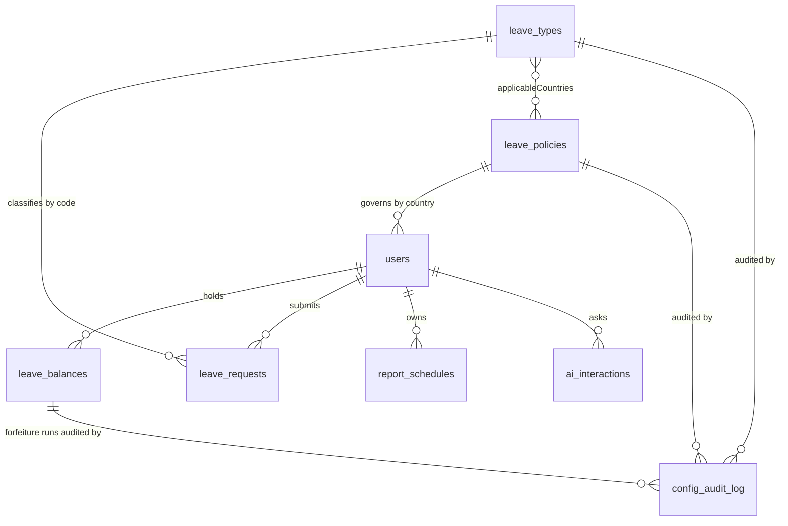

# Database Schema — Member 5 (Nabil)

**Author:** Nabil Hady · Member 5 — HR Admin, Analytics & Automation
**Database:** MySQL 8 via Sequelize 6 (`server/models/`), schema created by `sequelize.sync({ alter: true })` at startup
**Ownership:** schema design and migrations for the whole team sit in my vertical — every member designs the tables their feature needs, and changes come through me so no two people alter the same table blind

The database is shared by all five members. This document covers the tables my use cases own or extend, states what I own within shared tables, and lists the rest for completeness.

**Conventions:** every table has an auto-increment `id`, plus `createdAt` and `updatedAt` maintained by Sequelize. Attributes are camelCase; each model pins an explicit snake_case `tableName`. Foreign keys are declared through `associate()`.

> **Divergence from the original design.** The plan specified PostgreSQL with snake_case columns, a `hod_id` reporting column, and a separate `attachments` table. Delivered: MySQL, Sequelize camelCase, no `hod_id`, and certificates stored on the request row. Reporting-line columns (`supervisor_id`, `manager_id`) were never implemented — routing is team-based. A fifth role, `BOSS`, was added during the build to decide a Manager's own leave.

---

## ER diagram — the tables my use cases touch

---

## Tables I own

### `leave_types` — UC-10

The configurable catalogue that decides what leave exists and who may take it.

| Column | Type | Null | Default | Notes |
|---|---|---|---|---|
| `id` | INTEGER | no | auto | Primary key |
| `code` | STRING(20) | no | — | **Unique.** Lowercased on write. `annual`, `sick_mc`, `sick_nomc`, `unpaid`, `maternity`, `ns_reservist`, `compassionate`, `childcare` |
| `name` | STRING(50) | no | — | Display name in the dropdown |
| `affectsAnnualBalance` | BOOLEAN | no | `false` | Draws down the annual pool |
| `affectsSickBalance` | BOOLEAN | no | `false` | Draws down the sick pool |
| `requiresMc` | BOOLEAN | no | `false` | Submission blocked without an attached certificate |
| `active` | BOOLEAN | no | `true` | Inactive types leave new applications; pending requests unaffected |
| `applicableCountries` | JSON | **yes** | `NULL` | Array of 2-letter codes. **`NULL` = every country** |
| `genderRestriction` | ENUM | no | `ANY` | `ANY` \| `MALE` \| `FEMALE` |

**`NULL` rather than `[]` for "everywhere."** The original five leave types predate this column. Storing the universal case as `NULL` means they need no backfill and no migration — they read as "all countries" by definition, and an empty array from the UI is normalised to `NULL` on write. Backfilling every row with a ten-element array would have needed a data migration and broken the moment an eleventh country was added.

**JSON, not a join table.** A `leave_type_countries` join table is the textbook answer and would give referential integrity on the country code. Rejected because the list is read on every apply request and every dropdown load, is never queried *from the country side*, and is edited as one atomic unit by one screen. A join table adds a query to the hottest path in the app to buy integrity on a two-character code the UI already constrains to existing policy rows. If country codes ever needed their own attributes, this decision flips.

**A separate table rather than extending the request enum.** `leave_requests.leaveType` is a free-form code validated against this catalogue rather than a fixed ENUM, which is what lets HR add maternity or NS leave without touching the two-tier approval state machine three other members depend on.

**Gender as a row, not an `if`.** "Maternity is for women" lives in configuration. Adding NS leave for men in Singapore took one row and no deploy.

---

### `leave_policies` — UC-10

Per-country statutory policy. An employee's country decides both their public-holiday calendar and their entitlement bounds.

| Column | Type | Null | Default | Notes |
|---|---|---|---|---|
| `id` | INTEGER | no | auto | Primary key |
| `country` | STRING(2) | no | — | **Unique.** ISO-3166 alpha-2, uppercased |
| `countryName` | STRING(40) | no | — | Display name |
| `annualMin` | INTEGER | no | — | Statutory minimum annual days |
| `annualMax` | INTEGER | no | — | Company ceiling |
| `sickMc` | INTEGER | no | — | Sick days per year with a certificate |
| `sickNoMc` | INTEGER | no | — | Sick days per year without |
| `carryForwardMax` | INTEGER | no | `5` | Year-end carry-forward cap |

Seeded for all ten offices: SG, TH, CN, ID, JP, MY, MM, NZ, PH, VN.

**`carryForwardMax` is read in four places** — the carry-forward batch job, the forfeiture reminder service, the carry-forward summary report, and the AI-5 forfeiture flag. That was not true until late in the build: the last two hard-coded `5` while the first two read the row, so on any country with a different cap the reminder email and the report disagreed about the same employee. All four now go through `daysAtRisk()` in `server/services/leaveEligibility.js`.

---

### `leave_balances`

The per-employee, per-year, per-pool ledger. Read by every screen that shows a number.

| Column | Type | Null | Default | Notes |
|---|---|---|---|---|
| `id` | INTEGER | no | auto | Primary key |
| `userId` | INTEGER | no | — | FK → `users.id` |
| `leaveType` | ENUM | no | — | `annual` \| `sick_mc` \| `sick_nomc` — only balance-tracked pools |
| `year` | INTEGER | no | — | Leave year |
| `entitled` | DECIMAL(4,1) | no | `0` | This year's entitlement |
| `carried` | DECIMAL(4,1) | no | `0` | Brought forward, capped by `carryForwardMax` |
| `used` | DECIMAL(4,1) | no | `0` | Deducted on final approval |

**Remaining is derived, never stored:** `entitled + carried − used`. A stored column would be a second source of truth free to disagree with its own inputs after a partial cancellation or an HR adjustment. Half-days are why the type is `DECIMAL(4,1)`.

**Days at risk** = `max(0, remaining − carryForwardMax)`. One expression, four callers.

**A note on DECIMAL.** The MySQL driver returns these columns as **strings**. Every consumer must coerce with `Number()` — without it `"14" + "5"` concatenates to `"145"` and every derived figure is nonsense. This is asserted directly in `tests/nabil/m5.forfeitureRisk.test.js`.

---

### `config_audit_log` — UC-21

Append-only record of configuration and admin actions that are not tied to a single leave request: policy edits, leave-type changes, weekend config, blackout periods, announcements, entitlement runs, carry-forward, forfeiture reminder runs, invitations, session revokes.

| Column | Type | Null | Notes |
|---|---|---|---|
| `id` | INTEGER | no | Primary key |
| `action` | STRING(200) | no | Human-readable, e.g. `Leave type maternity updated` |
| `actorName` | STRING(50) | no | Acting user's name, or `System` for scheduled jobs |
| `entity` | STRING(50) | yes | Logical table, e.g. `leave_types`, `leave_policies`, `leave_balances` |
| `entityId` | STRING(50) | yes | **String, not integer** — some keys are codes (`maternity`, `SG`) rather than ids |
| `before` | JSON | yes | Full prior state; `NULL` on create |
| `after` | JSON | yes | Full new state; `NULL` on delete |

**Two audit tables, one viewer.** `audit_logs` (M3) stays request-scoped, keyed to a `requestId`. This table covers everything that has no request to attach to. The viewer merges both and prefixes ids `L` or `C`, because the two tables have independent auto-increments and a bare integer would collide across sources.

**Full snapshots, not per-field diffs.** A diff is smaller and reads more nicely, but reconstructing "what did this row look like on 3 August" from a chain of diffs means replaying every entry in order and trusting none is missing. Whole snapshots let any single row answer that on its own. Storage cost is irrelevant at this scale.

**No update or delete path exists in the API.** Immutability is structural, not a permission that could later be misconfigured.

---

### `report_schedules` — UC-30

A recurring report delivery. A `setInterval` sweep (no node-cron, matching the M3 reminder pattern) generates the report scoped to the owner's role visibility and emails it to the recipient list.

| Column | Type | Null | Default | Notes |
|---|---|---|---|---|
| `id` | INTEGER | no | auto | Primary key |
| `ownerUserId` | INTEGER | no | — | FK → `users.id`, alias `owner` |
| `ownerName` | STRING(50) | no | — | Denormalised for display without a join |
| `reportType` | ENUM | no | — | `leave_utilisation` \| `carry_forward_summary` \| `sick_leave_trend` \| `pending_overview` |
| `frequency` | ENUM | no | `monthly` | `weekly` \| `monthly` \| `quarterly` |
| `format` | ENUM | no | `CSV` | `CSV` \| `PDF` |
| `recipients` | JSON | no | `[]` | Array of email strings; external addresses permitted |
| `active` | BOOLEAN | no | `true` | Paused schedules are kept, not deleted |
| `lastRunAt` | DATE | yes | `NULL` | Stamped on every delivery, manual or scheduled |

**`ownerUserId` is the scope, not the recipient list.** Reports generate against the owner's visibility, so adding an HR address to a Manager's schedule cannot escalate what the report contains.

**`reportType` as an ENUM, unlike `leave_types.code`.** The four reports are functions in `reportService.REPORTS` — adding one requires code, so the database constraint costs nothing and catches a typo at write time. Leave types are data HR adds at runtime, so the same constraint there would defeat the feature. Same-shaped decision, opposite answer, for a reason worth stating.

---

### `ai_interactions`

Observability for every AI call across all five verticals.

| Column | Type | Null | Notes |
|---|---|---|---|
| `id` | INTEGER | no | Primary key |
| `userId` | INTEGER | no | FK → `users.id` |
| `feature` | STRING(20) | no | `AI-1` … `AI-5` |
| `input` | TEXT | no | The question, or a context marker such as `dashboard` |
| `output` | TEXT | no | JSON response, truncated to 4000 chars on write |

Written by AI-3, AI-4 and AI-5 among others. The truncation is deliberate: a full anomaly payload can be large, and the log exists to answer "what was asked and roughly what came back", not to be a second copy of the response.

---

## Table I extended

### `users` — one column added

| Column | Type | Null | Default | Notes |
|---|---|---|---|---|
| `gender` | ENUM(`MALE`, `FEMALE`) | **yes** | `NULL` | HR-set, like `country` and `team`. Drives gender-restricted leave eligibility |

**Nullable on purpose.** Every account that existed before this column keeps working, unset. The eligibility rule **fails closed** — an employee with no gender recorded sees no gender-restricted types, rather than all of them. Made non-nullable, this column would have demanded a value for every seeded account and forced a guess for anyone who declines to state one.

Optional throughout: on the HR create-employee form, and in CSV staff import, where the sixth column is sniffed — `MALE`/`FEMALE` reads as gender, anything else reads as the annual-days figure that column used to hold. CSVs written before this change still import correctly.

The other columns on `users` (auth, 2FA, lockout, locale, notification preferences, invitation status) belong to M1's vertical. Note the role ENUM now carries five values: `EMPLOYEE`, `SUPERVISOR`, `MANAGER`, `HR_ADMIN`, `BOSS`.

---

## Full delivered table list

| Table | Purpose | Owner |
|---|---|---|
| `users` | Accounts, roles, country, team, gender, auth state | M1 (`gender`: M5) |
| `user_invitations` | Onboarding tokens | M1 |
| `user_sessions` | Active sessions | M1 |
| `security_events` | Login history, lockout | M1 |
| `two_factor_challenges` | 2FA codes | M1 |
| `announcements` | System broadcasts | M1 |
| `announcement_acks` | Acknowledgements | M1 |
| **`leave_types`** | **Configurable leave catalogue** | **M5** |
| **`leave_policies`** | **Per-country entitlement policy** | **M5** |
| **`leave_balances`** | **Per-employee, per-year ledger** | **M5** |
| `leave_requests` | Applications and approval state | M2 / M3 |
| `leave_swap_requests` | Swap state machine | M2 |
| `comments` | Append-only discussion thread | M3 |
| `delegations` | Acting approvers | M3 |
| `notifications` | In-app notifications | M3 |
| `audit_logs` | Request-scoped audit | M3 |
| `country_working_days` | Weekend configuration per country | M4 |
| `public_holidays` | Per-country holiday calendar | M4 |
| `blackout_periods` | Restricted leave windows | M4 |
| **`report_schedules`** | **Automated report delivery** | **M5** |
| **`config_audit_log`** | **Configuration audit trail** | **M5** |
| **`ai_interactions`** | **AI call log** | **M5** |

---

## Decisions taken as schema owner

**Additive migrations only, after Phase 3.** Once five people were building against the same tables, every change I accepted had to be an added nullable column or a new table. No renames, no type narrowing, no dropped columns. A rename that is trivial in isolation becomes four broken branches when the team is exchanging zip files rather than sharing a repository — which is how this project actually ran.

**One migration reviewer.** Every member designed the tables their vertical needed, but changes came through me. This caught two collisions before they reached the database: two people about to add differently-named columns for the same concept, and one change that would have narrowed a column another member was already writing wider values into.

**`sequelize.sync({ alter: true })` rather than migration files.** Right for a prototype where the schema moved daily and nobody shared a database. Wrong for anything with real data — `alter` will silently drop a column it thinks is unused. If this went to production the first task would be freezing the schema and moving to `sequelize-cli` migrations.

**Constraints where the app cannot be trusted, validation where it can.** `code` and `country` carry unique constraints because a duplicate there corrupts lookups permanently. Ranges like `annualMin ≤ annualMax` are enforced in Yup at the route rather than as a CHECK constraint — they are policy, they change, and a validation message reads better than a driver error.
