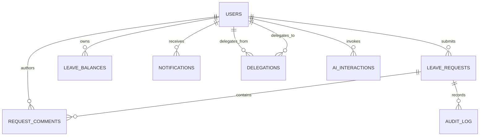

# Database Schema — Member 3

**Author:** Wai Yan Hpone Lat  
**Database:** MySQL 8 with Sequelize  
**Scope:** tables and relationships used by approval, delegation, notifications, comments, reminders, audit, and AI-3

The schema is defined by the models in `server/models/`. Primary keys plus `createdAt` and `updatedAt` are supplied by Sequelize unless stated otherwise.

## ER diagram

`notifications.requestId` is a nullable logical link to a leave request in the current model. `audit_log.requestId` is also nullable so delegation lifecycle events can be audited without a leave request.

## `users`

Shared identity table read by M3 routing and delivery.

| Column | Type / null | M3 meaning |
|---|---|---|
| `id` | integer PK | Actor and recipient identifier. |
| `name` | varchar(50), not null | Display and audit actor name. |
| `email` | varchar(50), not null | Email notification destination. |
| `role` | enum, not null | `EMPLOYEE`, `SUPERVISOR`, `MANAGER`, `HR_ADMIN`, `BOSS`. |
| `team` | varchar(50), not null | Legacy/team fallback scope for normal approvals. |
| `status` | enum, not null | Only `ACTIVE` users receive authority/delivery. |
| `notifyEmail` | boolean, not null | Independent email preference. |
| `notifyInApp` | boolean, not null | Independent in-app preference. |

The service is prepared to read optional `supervisorId` / `managerId` reporting-line fields when an integrated schema supplies them; otherwise it falls back to team scope.

## `leave_requests`

Core state-machine entity.

| Column | Type / null | M3 meaning |
|---|---|---|
| `id` | integer PK | Request identifier. |
| `employeeId` | integer FK → `users.id` | Owner; an actor with this ID cannot decide the request. |
| `leaveType` | varchar(30), not null | Catalogue code. |
| `startDate`, `endDate` | date, not null | Requested period. |
| `days` | decimal(4,1), not null | Final deduction quantity; supports half days. |
| `reason` | varchar(200), not null | Applicant reason. |
| `status` | enum, not null | `DRAFT`, three pending tiers, `APPROVED`, `REJECTED`, `CANCELLED`. |
| `flagged` | boolean, not null | Coverage exception requiring explicit Manager acknowledgement. |
| `supervisorNote` | varchar(500), nullable | Supervisor rejection/decision note. |
| `managerNote` | varchar(500), nullable | Manager/Boss rejection/decision note. |
| `stageEnteredAt` | datetime, nullable | Start of current tier's 24-hour reminder clock. |
| `reminderSentAt` | datetime, nullable | Last successful reminder timestamp. |
| `lastReminderKey` | varchar(255), nullable | Idempotency claim for stage/recipient/window. |
| `routedTeam` | varchar(50), nullable | Legacy compatibility only; no longer drives delegation routing. |
| `submissionKey` | varchar(80), nullable | Retry/double-click idempotency key from the shared submit flow. |

Unique index: `(employeeId, submissionKey)`. Multiple legacy `NULL` keys remain valid.

## `leave_balances`

| Column | Type / null | Meaning |
|---|---|---|
| `id` | integer PK | Balance row. |
| `userId` | integer FK → `users.id` | Balance owner. |
| `leaveType` | varchar(30), not null | Tracked leave catalogue code. |
| `year` | integer, not null | Leave year. |
| `entitled` | decimal(4,1), not null | Base entitlement. |
| `carried` | decimal(4,1), not null | Carried amount. |
| `used` | decimal(4,1), not null | Incremented only on final approval; restored only by approved cancellation/shortening flows. |

Final approval locks both the request and relevant balance row in one transaction to prevent double deduction.

## `delegations`

| Column | Type / null | Meaning |
|---|---|---|
| `id` | integer PK | Delegation identifier. |
| `fromUserId` | integer FK → `users.id` | Original Supervisor or Manager. |
| `toUserId` | integer FK → `users.id` | Same-tier temporary delegate. |
| `startDate` | date, not null | Inclusive start. |
| `endDate` | date, not null | Inclusive end. |
| `reason` | varchar(200), nullable | Human context. |
| `active` | boolean, not null | False after explicit revocation. |
| `revokedAt` | datetime, nullable | Revocation time. |
| `expiryNotifiedAt` | datetime, nullable | Prevents repeated expiry notifications. |

Effective authority requires `active = true` and `startDate <= today <= endDate`; history is retained after expiry.

## `notifications`

| Column | Type / null | Meaning |
|---|---|---|
| `id` | integer PK | Notification identifier. |
| `userId` | integer FK → `users.id` | Recipient/ownership boundary. |
| `message` | varchar(255), not null | Safe in-app message. |
| `readAt` | datetime, nullable | Null means unread. |
| `type` | varchar(20), nullable | Examples: `APPROVAL`, `COMMENT`, `REMINDER`, `DELEGATION`. |
| `requestId` | integer, nullable | Related leave request when applicable. |

Every read/update query is scoped to the authenticated `userId`.

## `request_comments`

| Column | Type / null | Meaning |
|---|---|---|
| `id` | integer PK | Comment identifier. |
| `requestId` | integer FK → `leave_requests.id` | Thread owner; cascades on request deletion. |
| `authorId` | integer FK → `users.id` | Posting participant. |
| `body` | varchar(500), not null | Append-only message. |
| `authorName` | varchar(50), not null | Snapshot for display/audit continuity. |
| `authorRole` | enum, not null | Employee/Supervisor/Manager/HR role snapshot. |

Creation occurs in the same transaction as its audit row. Terminal requests remain readable but accept no new comment.

## `audit_log`

| Column | Type / null | Meaning |
|---|---|---|
| `id` | integer PK | Audit event identifier. |
| `requestId` | integer FK → `leave_requests.id`, nullable | Request event; null for delegation lifecycle. |
| `actorName` | varchar(50), not null | Human actor snapshot. |
| `action` | varchar(200), not null | Decision/comment/delegation action summary. |
| `createdAt` | datetime | Immutable sequence time. |

The application appends records and exposes no update/delete audit endpoint. Comment audit actions do not copy private comment text.

## `ai_interactions`

The shared AI audit model stores the invoking `userId`, feature identifier (for example `AI-3`, `AI-coverage-brief`, `AI-draft-note`), a compact input reference, and serialized output. AI records are evidence of an advisory interaction only; they do not authorize or represent a leave decision.

## Relationship and transaction rules

1. A `User` owns many leave requests, balances, and notifications.
2. A delegation has two user relationships: `fromUser` and `toUser`.
3. A leave request has many comments and audit events.
4. Decision status, decision note/comment, audit entry, and balance mutation commit atomically.
5. Comment plus comment-audit entry commit atomically.
6. Delegation creation/revocation and its audit entry commit atomically.
7. Notification/email work runs after business commit, so provider failure cannot undo a decision.

## Data minimization

Approval endpoints use an allowlist of employee fields. Password hashes, reset data, 2FA secrets, lockout internals, and other authentication fields are never serialized in M3 approval responses. Team-calendar responses expose only member IDs, names, initials, and approved scheduling dates.
