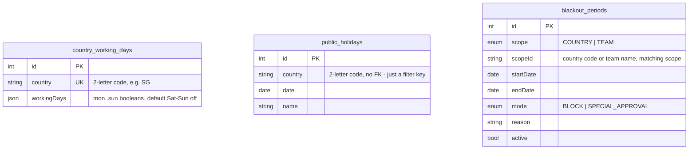

# Database Schema — Member 4 view

**Author:** Wei Jun · Member 4
**Database:** MySQL 8 via Sequelize (`backend/src/models/`), schema created by
`sequelize.sync({ alter: true })` at startup.

The database is shared by all five members. This document covers the three
tables my vertical owns outright, plus the tables I read from but do not own
(shown at the end for reference). None of my tables have a foreign key to
another table — they are all configuration/reference data, keyed by a country
code or a team name rather than by a row id from another table. That is a
deliberate shape: a blackout period or a weekend config should still make sense
even if the user or leave-request row it was checked against is later deleted.

---

## ER diagram — the tables I own

No `erDiagram` relationship lines above — that is not an omission. All three
tables are looked up by value (a country code or team name string), not joined
by id, which is why they can be read without ever loading a `users` or
`leave_requests` row.

---

## `country_working_days` (UC-29)

**Purpose:** the per-country weekend map every duration calculation reads. One
row per country that differs from the Sat/Sun default; a country with no row
simply uses the default.

| Column | Type | Null | Key | Notes |
|---|---|---|---|---|
| `id` | INTEGER | no | PK | auto-increment |
| `country` | STRING(2) | no | UK (`country_working_days_country_unique`) | Always stored uppercase by the route layer before write |
| `workingDays` | JSON | no | | `{ mon, tue, wed, thu, fri, sat, sun }`, each a boolean. Default `{ mon:true, tue:true, wed:true, thu:true, fri:true, sat:false, sun:false }` |
| `createdAt` / `updatedAt` | DATETIME | no | | Sequelize timestamps |

**Design notes**

- **JSON column instead of seven boolean columns.** The whole map is always read
  and written as a unit (nobody asks "is Tuesday a working day for Singapore" in
  isolation), so a single JSON value avoids seven columns that are never queried
  independently, and keeps `hasAtLeastOneWorkingDay` a pure in-memory check
  instead of a row of `AND`s.
- **No `active` flag.** Unlike `blackout_periods`, a weekend configuration has no
  concept of being retired — a country either has a current map or falls back to
  the default. History of *changes* lives in `ConfigAuditLog` instead, which is
  the right place for "what did this used to be", not this table.
- **Unique constraint is named explicitly** (`country_working_days_country_unique`)
  rather than left as an anonymous `unique: true`. This is not stylistic —
  Jervis's AI log
  (`ai/jervis/ai-logs/2026-08-09-ai-features-and-form-controls.md`) documents a
  real incident where several models used anonymous unique constraints and
  `sequelize.sync({ alter: true })` added a fresh duplicate index on every server
  restart until MySQL's 64-index-per-table limit was hit and the server could not
  boot. This table is one of the ones that got fixed.

---

## `public_holidays` (UC-06)

**Purpose:** the public holiday calendar every duration calculation excludes.

| Column | Type | Null | Key | Notes |
|---|---|---|---|---|
| `id` | INTEGER | no | PK | auto-increment |
| `country` | STRING(2) | no | | Not unique or foreign-keyed — many rows share a country, one per holiday date |
| `date` | DATEONLY | no | | `YYYY-MM-DD` |
| `name` | STRING(80) | no | | e.g. `"Chinese New Year"` |
| `createdAt` / `updatedAt` | DATETIME | no | | Sequelize timestamps |

**Design notes**

- **No unique constraint on `(country, date)`.** This is a real gap, not a design
  choice — `POST /holiday/import` can create a duplicate row for the same country
  and date. It does not corrupt day-counting (the calculation service turns the
  result into a `Set<string>` of ISO dates, so a duplicate collapses harmlessly at
  read time), but it is untidy and worth a composite unique index as a follow-up.
- **`country` is a plain string, not a foreign key to a countries table.** There
  is no dedicated countries table in this schema — `country` codes are validated
  at the application layer against `LeavePolicy` (which countries have a policy
  configured) rather than a referential-integrity constraint. This is consistent
  with how `blackout_periods.scopeId` and `users.country` also work: the "is this
  a real country" check is business logic, not a database constraint, across the
  whole schema, not just my tables.
- **Scale:** 200 rows seeded for 2026 across the company's 10 operating
  countries. A holiday lookup for a single country's calendar is a simple indexed
  filter, not a concern at this size, but there is no explicit index on `country`
  or `date` beyond the implicit primary key — worth adding if the table grows
  much further (multi-year imports, more countries).

---

## `blackout_periods` (UC-18)

**Purpose:** date ranges where leave is either blocked outright or requires
special approval, scoped to a country or a team.

| Column | Type | Null | Key | Notes |
|---|---|---|---|---|
| `id` | INTEGER | no | PK | auto-increment |
| `scope` | ENUM(`COUNTRY`, `TEAM`) | no | | Default `COUNTRY` |
| `scopeId` | STRING(50) | no | | A country code when `scope=COUNTRY`, a team name when `scope=TEAM` — the meaning of this column depends on the sibling `scope` column, which is why it cannot be a single foreign key |
| `startDate` / `endDate` | DATEONLY | no | | Inclusive range |
| `mode` | ENUM(`BLOCK`, `SPECIAL_APPROVAL`) | no | | Default `SPECIAL_APPROVAL` |
| `reason` | STRING(200) | yes | | Shown to employees on the calendar and to approvers reviewing a flagged exception |
| `active` | BOOLEAN | no | | Default `true`. Deactivated, never deleted |
| `createdAt` / `updatedAt` | DATETIME | no | | Sequelize timestamps |

**Design notes**

- **`scope` + `scopeId` as a discriminated pair, not two nullable foreign keys.**
  An earlier shape I considered was `countryId` (nullable) and `teamId`
  (nullable) as two separate foreign-key columns. I rejected it: a row would
  always have exactly one of the two populated, which is exactly the shape a
  discriminated `scope`/`scopeId` pair expresses directly, without a `CHECK`
  constraint MySQL/Sequelize does not enforce cleanly and without every reader
  having to remember "exactly one of these two must be set."
- **Soft-delete (`active`) rather than hard delete.** A blackout period that
  governed a past approval decision needs to stay reconstructable — a request
  approved under `SPECIAL_APPROVAL` because of a period that has since been
  removed should still be explainable months later. Deactivating preserves the
  row and its `ConfigAuditLog` trail; deleting would not.
- **No overlap-prevention constraint at the database level.** Two periods with
  the same scope can have overlapping date ranges (e.g. a country-wide close and
  a team-specific audit in the same week) — this is intentional, not a bug: `mode`
  resolution (`BLOCK` beats `SPECIAL_APPROVAL`) happens in
  `staffingService.blackoutForRange` precisely because more than one period can
  legitimately apply at once.
- **Scale:** low-volume, admin-created data — tens of rows in practice, not
  thousands. No index beyond the primary key is currently needed; if this grew
  large, `(scope, scopeId, startDate, endDate)` would be the natural composite
  index for the overlap query.

---

## Tables I read but do not own

| Table | Owner | Why I touch it |
|---|---|---|
| `leave_policies` | M5 (Nabil) | `GET /coverage/options` and blackout country validation both check "is this a real, configured country" against this table rather than a hard-coded list |
| `users` | M1 (Jordon) | `country` and `team` columns are read (never written) to resolve a caller's own scope for the team calendar and blackout defaults |
| `leave_requests` | M2 (Jervis) | `startDate`/`endDate`/`status` are read (never written by my code) when computing who is "off" on a given day for coverage evaluation |
| `config_audit_log` | shared | Written to by all three of my mutation endpoints (weekend config, blackout create/deactivate) — not owned by any one vertical, it is the group's shared audit trail |

I do not have an opinion on those tables' own schema design — see their owners'
documents for that.
