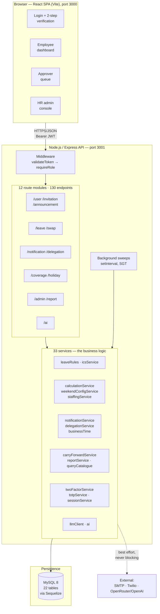
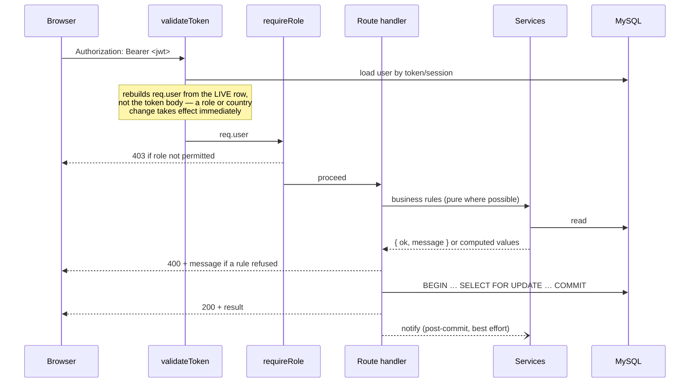
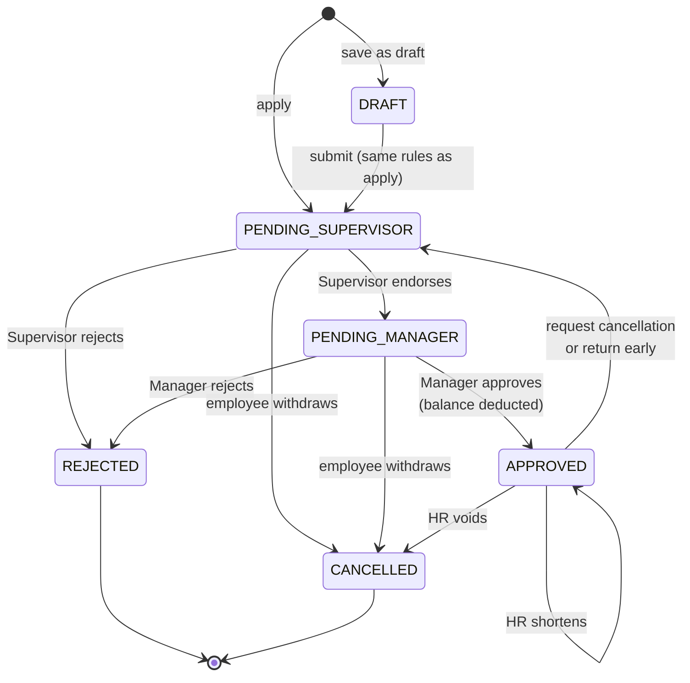
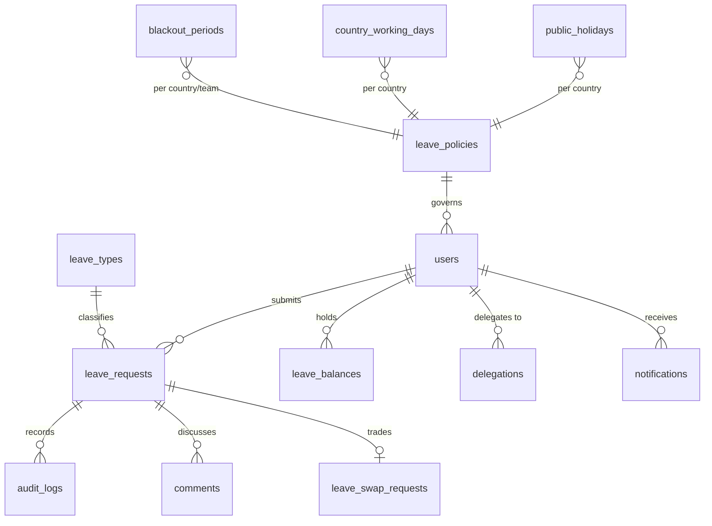

# System Architecture — Innovare Leave Management System

**Project:** SCCCI AI Challenge 2B · Group 4
**Status:** describes the **integrated build as it actually is**, not the original design.
**Last verified:** 9 August 2026 — route inventory, model list, dependency list and
background jobs in this document were read from the running code, not from the plan.

> **Includes the `approvalChain` refactor.** The approval hierarchy is now derived
> from one module (`server/services/approvalChain.js`) and adds a **BOSS** role and
> a **`PENDING_BOSS`** stage, so a Manager's own leave is decided by the Boss and
> the Boss's own leave by any Manager. Five roles, not four.


> **About the diagram.** `architecture-diagram.png` is produced by
> `render-architecture-diagram.ps1` in this folder — it draws the image directly
> with the .NET graphics library that ships with Windows, so regenerating it needs
> no toolchain, no network and no extra project dependency:
>
> ```powershell
> ./docs/render-architecture-diagram.ps1
> ```
>
> The mermaid blocks throughout this document are the detailed views (request
> lifecycle, state machine, ER diagram) and render directly on GitHub. Update the
> script and re-run it if the high-level picture changes.

---

## 1. Shape of the system

Three tiers, deliberately conventional:



**Why a single API process rather than microservices.** Five members owning five
verticals is an organisational split, not a deployment one. One process keeps a
single database transaction available across verticals — which matters, because
approving leave writes a request, a balance, an audit row and a notification, and
those must not partially succeed. The vertical boundaries are enforced by module
ownership and service contracts instead.

---

## 2. Vertical ownership

Each member owns one user role end-to-end — frontend and backend — rather than a
horizontal layer. The seams between verticals are service calls, not shared code.

| Member | Vertical | Owns (routes) | Owns (key services) |
|---|---|---|---|
| **Jordon** | Authentication, accounts, onboarding | `/user`, `/invitation`, `/announcement` | `twoFactorService`, `totpService`, `sessionService`, `entitlementService`, `secretCrypto` |
| **Jervis** | Employee leave experience | `/leave` (employee half), `/swap`, `/ai/parse` | `leaveRules`, `icsService`, `mcCheck` |
| **Wai Yan** | Approval, delegation, notification | `/leave` (decision half), `/notification`, `/delegation` | `notificationService`, `delegationService`, `businessTime`, `mailer`, `llmClient` |
| **Wei Jun** | Coverage, calendar, scheduling rules | `/coverage`, `/holiday` | `calculationService`, `weekendConfigService`, `staffingService`, `coverage` |
| **Nabil** | HR admin, analytics, automation | `/admin`, `/report` | `carryForwardService`, `reportService`, `queryCatalogue`, `anomalyDetector` |

`routes/leaveRequest.js` is the one genuinely shared module: the employee half
(apply, drafts, forecast, cancel, shorten, attachments, `.ics`) is M2's, the
decision half (`/pending`, `/:id/decide`, `/bulk-decide`, comments) is M3's. They
share one file because they operate on one table and one state machine; splitting
them would have meant duplicating the request-loading and authorisation code.

---

## 3. Request lifecycle

Every authenticated request follows the same path:



Four rules hold across every vertical:

1. **The server decides.** The UI hides controls a role cannot use, but every rule
   is enforced again server-side. Calling the API directly gains nothing.
2. **`req.user` comes from the database, not the token.** A JWT is a claim about
   who you were at sign-in; authorisation reads the current row.
3. **State changes run in a transaction with a row lock.** Approving, cancelling,
   shortening and swapping all take `SELECT … FOR UPDATE` on the rows they move,
   so two approvers clicking at the same instant queue rather than both reading a
   stale balance.
4. **Delivery is post-commit and best effort.** Email, SMS and in-app
   notifications are sent *after* the transaction commits, inside `try/catch`. A
   mail server being down must never roll back a valid approval.

---

## 4. The two-tier approval state machine

The core of the domain. Every leave request moves through it, and three different
kinds of change reuse it rather than each having their own pipeline.



**Design decision worth defending.** A change to *approved* leave is not a
separate workflow — it re-enters the same chain, distinguished by two columns on
the request:

| `cancellationRequested` | `pendingEndDate` | Meaning |
|---|---|---|
| `false` | `null` | An ordinary application |
| `true` | `null` | Withdraw the whole leave |
| `true` | a date | Return early — keep the leave, end it on that date |

That is why there is one decision endpoint rather than three, and why a change to
the approval rules cannot accidentally apply to applications but not to
cancellations.

**No auto-approval anywhere.** A Supervisor endorsement never finalises; only the
role that owns the final stage can approve. An approver can never decide their own
request. `services/approvalChain.js` is the single source of truth for who decides
what:

| Applicant | Stage 1 | Stage 2 | Decided by |
|---|---|---|---|
| EMPLOYEE / HR_ADMIN | `PENDING_SUPERVISOR` | `PENDING_MANAGER` | own-team Supervisor, then own-team Manager |
| SUPERVISOR | `PENDING_MANAGER` | — | own-team Manager only |
| MANAGER | `PENDING_BOSS` | — | the Boss only |
| BOSS | `PENDING_MANAGER` | — | any Manager, company-wide |

The two executive rows exist because a Manager has no conflict-free peer at their
own tier, so their leave goes up to the Boss; the Boss has nobody above them, so
theirs goes back down to the Manager tier — and since the Boss sits above every
team, **any** active Manager may decide it.

---

## 5. Data model

22 tables. The core cluster:



| Group | Tables | Owner |
|---|---|---|
| Identity & access | `users`, `user_sessions`, `two_factor_challenges`, `user_invitations`, `security_events` | M1 |
| Leave core | `leave_requests`, `leave_balances`, `leave_swap_requests`, `audit_logs` | M2 |
| Workflow | `delegations`, `notifications`, `comments` | M3 |
| Calendar & rules | `public_holidays`, `country_working_days`, `blackout_periods`, `leave_policies` | M4 |
| Admin & analytics | `leave_types`, `announcements`, `announcement_acks`, `config_audit_logs`, `report_schedules`, `ai_interactions` | M5 |

**Schema is created by `sequelize.sync({ alter: true })` at startup** rather than
by migration files. Honest trade-off: it made five people adding columns to shared
tables painless during development, and it is the wrong choice for production,
where an unreviewed `ALTER` against live data is unacceptable. Migrations would be
the first thing to add if this shipped.

**Money-like values use `DECIMAL(4,1)`, never floats.** Half-days must be exact,
and repeated float arithmetic on a leave balance drifts.

---

## 6. Cross-cutting contracts

The rules that stop five verticals from disagreeing with each other. Each one
exists because the alternative was two components computing the same thing
differently.

| Contract | Rule | Why |
|---|---|---|
| **Day counting** | Only `calculationService.workingDaysInRange()` may count chargeable days. No vertical re-implements it. | M2's forecast, M2's deduction, M5's carry-forward and M2's swap comparison must agree to the half-day, always. |
| **Weekends** | Read from `country_working_days`, never hard-coded Sat/Sun. | The team spans SG, VN and TH. A hard-coded weekend silently overcharges anyone whose weekend differs. |
| **"Today"** | `businessTime.todayISO()` — Asia/Singapore, always. | `new Date().toISOString()` is UTC. On a UTC host that is *yesterday* for the first eight hours of every SGT day, silently shifting every date comparison. This caused a real bug in delegation windows. |
| **Balance movement** | Deducted only on final Manager approval; restored only through `restoreDays()` inside the same transaction. | Prevents double-deduction and lost updates. |
| **Leave types** | Come from the `leave_types` catalogue, filtered by country and gender. Never a hard-coded list. | HR can add a leave type without a code change. |
| **Notifications** | Always post-commit, always inside `try/catch`. | A dead SMTP server must not roll back an approval. |
| **AI** | Advisory only. Never writes state, never relaxes a rule, always has a deterministic fallback. | See §8. |

---

## 7. Authentication and authorisation

**Sign-in is two-step and mandatory.** Password verification returns a *challenge
token*, never an access token. The user then picks a delivery method — email, SMS,
or an authenticator app (TOTP) — and only a verified 6-digit code yields a JWT.

- Passwords: `bcryptjs`, 10 rounds.
- TOTP secrets: encrypted at rest with AES-GCM (`secretCrypto`), random IV per
  encryption, so identical secrets never produce identical ciphertext.
- Codes: hashed before storage, 10-minute expiry, capped attempts and resends.
- Sessions: tracked in `user_sessions` and individually revocable, so a
  force-logout takes effect immediately rather than waiting for token expiry.
- Failed sign-ins lock the account; HR **and** any Manager can unlock — including
  a locked-out HR Admin, who would otherwise have no route back in.

**Authorisation is role plus relationship.** `requireRole()` filters by role;
`canActOn()` then answers "may *this* approver act on *this* request", accounting
for team, tier, active delegation, and the conflict-of-interest rules. The same
function backs both the queue listing and the decision endpoint, so the queue can
never show something the API would refuse.

---

## 8. AI integration

Five AI features across the team, all built on one principle: **AI is advisory and
must degrade cleanly.**

| Feature | Owner | What it does |
|---|---|---|
| AI-1 | Jervis | Natural-language leave application → structured form fields |
| AI-2 | Wei Jun | Coverage analysis and explanation |
| AI-3 | Wai Yan | Approval summary for the approver queue |
| AI-4 | Nabil | HR chatbot over a parameterised query catalogue |
| AI-5 | Nabil | Anomaly detection — forfeiture risk, burnout patterns |

Four constraints, enforced in code:

1. **A deterministic fallback always exists.** With no API key, AI-1 falls back to
   an offline regex parser and reports `source: "heuristic"`. The system is fully
   usable with no internet and no spend.
2. **The AI is never trusted with the calendar.** Whatever produces a date, it is
   re-checked server-side against that employee's own country calendar. Language
   models are poor at weekday arithmetic.
3. **AI never writes state.** AI-1 pre-fills a form; the employee reviews and
   submits. AI-4 runs *parameterised* queries from a fixed catalogue — there is no
   free SQL path.
4. **Provider access is centralised** in `llmClient`, which owns the timeout,
   response sanitising and safe error codes. A provider failure surfaces as
   "Hosted AI is temporarily unavailable", never a raw upstream error.

Every AI call is recorded in `ai_interactions` for the audit trail.

---

## 9. Background jobs

Four scheduled sweeps, all `setInterval` on Singapore time. **`node-cron` is not
used** — the original design specified it, but a plain interval needed no
dependency and no separate process, and every job is idempotent so a missed or
repeated tick is harmless.

| Sweep | Interval | Purpose |
|---|---|---|
| Pending-approval reminders | hourly | 24-hour nudge to the responsible approver |
| Delegation expiry | hourly | Notifies when an acting-approver window closes |
| Scheduled report delivery | hourly | Emails due reports |
| Year-end carry-forward | daily | Rolls balances at year-end (also manually triggerable by HR) |

Leave-swap proposals expire lazily instead: the 48-hour check runs on read, so no
job is needed at all.

---

## 10. Technology and why

| Layer | Choice | Reasoning |
|---|---|---|
| Frontend | React 18 + Vite, Tailwind | Vite's dev server is fast enough that five people could iterate without fighting rebuild times |
| HTTP | axios | Interceptor attaches the JWT in one place |
| Backend | Node.js + Express | One language across the stack; the team already knew it |
| ORM | Sequelize | Model-per-file suited five people owning different tables; `sync({ alter: true })` removed migration coordination during development |
| Database | MySQL 8 | Required by the brief; transactions with row-level locking are what the balance logic depends on |
| Validation | yup | Schema-per-endpoint, consistent error shape |
| Auth | jsonwebtoken + bcryptjs + otplib | Standard, well-understood primitives rather than a framework |
| Mail | nodemailer | Direct SMTP with no third-party service dependency |
| Testing | Jest + supertest | Integration tests drive the real Express app against a real MySQL schema |

**Runtime dependencies are deliberately few** — 11 on the server, 6 on the client.
Where a library was tempting we wrote the small thing instead: the `.ics` generator
is ~100 hand-written lines of RFC 5545 rather than a calendar package, and the
scheduler is `setInterval` rather than `node-cron`. Fewer dependencies meant fewer
version conflicts when five branches merged.

---

## 11. Testing strategy

**413 tests across 30 suites, all passing.**

```bash
cd server
npx jest
```

| Layer | Approach |
|---|---|
| Business rules | Pure functions taking plain values — no database, no request object. The bulk of the tests need only `npm install`. |
| API | supertest against the real Express app and a real MySQL schema. |
| Frontend | No component test framework; verified by production build plus `npm run check:undefined` (see below). |

Two structural decisions:

- **Each member's suites live in `tests/<member>/`, shared suites in
  `server/tests/`.** `jest.config.js` declares both roots, so one `npx jest` runs
  everything — individual ownership is visible without fragmenting the build.
- **Tests use a separate schema.** `tests/setupEnv.js` refuses to run unless
  `DB_NAME` contains "test", and blanks every AI key, so a test run can never
  touch demo data or spend provider credit.

**`client/scripts/checkUndefined.cjs`** parses every React source with Babel and
reports identifiers that resolve to nothing. It exists because an undefined
variable in JavaScript is only an error when its line runs — the production build
compiles it happily, and it presents as a button that does nothing. After the
five-way merge this found **five** dead controls across three pages that neither
the build nor the test suite could see.

---

## 12. Known limitations

Recorded deliberately rather than hidden.

| Limitation | Impact |
|---|---|
| Schema managed by `sync({ alter: true })`, not migrations | Unacceptable for production; fine for coursework |
| Leave spanning 31 December is charged entirely to the starting year | Wrong for cross-year leave; no split implemented |
| Two definitions of "current leave year" coexist | Balance display and deduction can disagree after a year-end rollover |
| Uploaded certificate type is taken from the browser, not verified from file bytes | A renamed file passes validation |
| Certificates stored in-row as base64 | Simple and self-contained; a real system would use object storage |
| No rate limiting on AI endpoints | Any authenticated user can drive provider spend |
| Sick-leave certificate threshold is a code constant | Should be per-country policy configuration |
| No automated frontend component tests | Mitigated by the build plus the undefined-identifier sweep |

---

## 13. Repository layout

```
leave-app/
├── client/                 React SPA (Vite)
│   ├── src/pages/          Login · Employee · Approver · Admin · Register
│   ├── src/components/     Shared UI (StatusStepper, CommentThread, TeamSchedule…)
│   ├── src/lib/            http (axios + JWT), dates, i18n, decisionFeedback
│   └── scripts/            checkSyntax · checkUndefined
├── server/                 Express API
│   ├── routes/             12 modules, 130 endpoints
│   ├── services/           33 services — the business logic
│   ├── models/             22 Sequelize models
│   ├── middlewares/        validateToken · requireRole
│   ├── scripts/            seed · migrations · verification helpers
│   └── tests/              shared and cross-vertical suites
├── docs/
│   ├── architecture.md     this file
│   ├── architecture-diagram.png
│   └── <member>/           each member's use cases, API and schema docs
├── tests/<member>/         each member's own suites
└── ai/<member>/            AI logs and reflection
```
