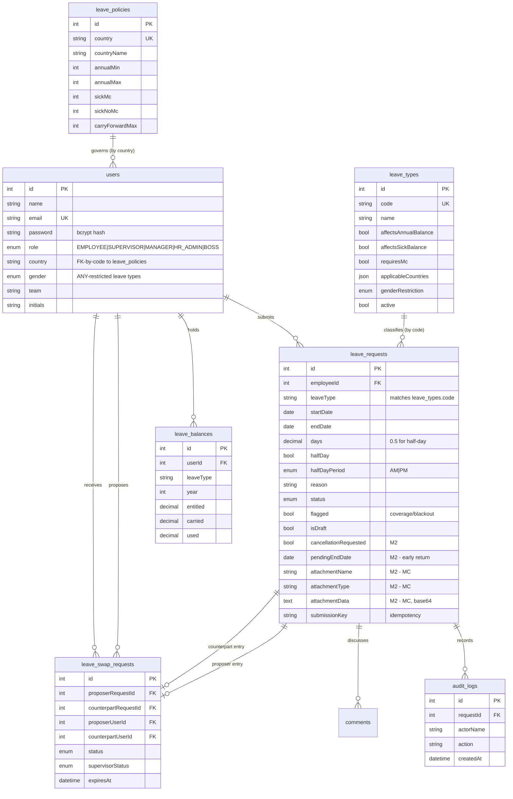

# Database Schema — Member 2 view

**Author:** Jervis · Member 2
**Database:** MySQL 8 via Sequelize (`server/models/`), schema created by
`sequelize.sync({ alter: true })` at startup.

The database is shared by all five members, so this document covers the tables my
use cases read and write, states which columns I own, and shows how they relate to
the rest. Tables belonging entirely to other verticals (sessions, 2FA challenges,
delegations, announcements, notifications, blackout periods, report schedules) are
listed at the end for completeness but documented by their owners.

---

## ER diagram — the tables my use cases touch



---

## `leave_requests` — the central table of my vertical

One row per leave request, including drafts. Columns marked **M2** are ones I added.

| Column | Type | Null | Default | Notes |
|---|---|---|---|---|
| `id` | INT | no | auto | PK |
| `employeeId` | INT | yes | — | FK → `users.id` |
| `leaveType` | VARCHAR(30) | no | — | Matches `leave_types.code` |
| `startDate` | DATE | no | — | |
| `endDate` | DATE | no | — | |
| `days` | DECIMAL(4,1) | no | — | Chargeable days; `0.5` for a half-day. Weekends and public holidays are **never** included |
| `halfDay` | BOOL | no | `0` | Single-day requests only |
| `halfDayPeriod` | ENUM(`AM`,`PM`) | yes | — | Set only when `halfDay` |
| `reason` | VARCHAR(200) | no | — | 3–200 chars |
| `status` | ENUM | no | `PENDING_SUPERVISOR` | `DRAFT`, `PENDING_SUPERVISOR`, `PENDING_MANAGER`, **`PENDING_BOSS`**, `APPROVED`, `REJECTED`, `CANCELLED` |
| `flagged` | BOOL | no | `0` | Coverage below threshold or a special-approval blackout — needs explicit Manager sign-off |
| `isDraft` | BOOL | no | `0` | **M2** — private, not routed |
| `cancellationRequested` | BOOL | no | `0` | **M2** — this pending cycle changes *approved* leave |
| `pendingEndDate` | DATE | yes | — | **M2** — proposed new end date while an early return awaits approval |
| `attachmentName` | VARCHAR(200) | yes | — | **M2** — medical certificate |
| `attachmentType` | VARCHAR(60) | yes | — | **M2** — PDF/JPG/PNG only |
| `attachmentData` | LONGTEXT | yes | — | **M2** — base64 data URL, ~5 MB cap |
| `supervisorNote` / `managerNote` | VARCHAR(500) | yes | — | Rejection reasons (M3) |
| `routedTeam` | VARCHAR(50) | yes | — | Legacy delegation routing (M3; no longer steers routing) |
| `stageEnteredAt` | DATETIME | yes | — | When it entered its current tier (M3 reminders) |
| `reminderSentAt` / `lastReminderKey` | — | yes | — | 24-hour reminder bookkeeping (M3) |
| `submissionKey` | VARCHAR(80) | yes | — | Idempotency key; unique per `(employeeId, submissionKey)` (M3) |
| `createdAt` / `updatedAt` | DATETIME | no | — | |

### The two flags read together — UC-03

`cancellationRequested` and `pendingEndDate` encode *what kind* of change to
approved leave is in flight:

| `cancellationRequested` | `pendingEndDate` | Meaning |
|---|---|---|
| `false` | `null` | An ordinary application |
| `true` | `null` | Withdraw the whole leave |
| `true` | a date | **Return early** — keep the leave, end it on that date |

On final approval a withdrawal becomes `CANCELLED` and all days return; an early
return **stays `APPROVED`**, `endDate` moves to `pendingEndDate`, `days` is
recomputed, and only the difference returns. Either way both flags are cleared.

### Status transitions

```
                    ┌─────────┐
                    │  DRAFT  │  (private, not routed)
                    └────┬────┘
                         │ submit
                         ▼
   apply ───────► PENDING_SUPERVISOR ──endorse──► PENDING_MANAGER ──approve──► APPROVED
                         │                              │                          │
                      reject                         reject                        │
                         ▼                              ▼                          │
                     REJECTED                       REJECTED                       │
                                                                                   │
        cancel while pending ──────────────► CANCELLED                             │
                                                                                   │
        APPROVED ──request cancellation──► PENDING_SUPERVISOR ─►─ PENDING_MANAGER ─┤
                                            (cancellationRequested = true)         │
                                              approve → CANCELLED, days returned   │
                                              refuse  → back to APPROVED ──────────┤
                                                                                   │
        APPROVED ──return early──────────► PENDING_SUPERVISOR ─►─ PENDING_MANAGER ─┤
                                            (+ pendingEndDate)                     │
                                              approve → APPROVED, endDate moved ───┘
                                              refuse  → back to APPROVED, unchanged

        APPROVED ──HR adjust (already started)──► APPROVED (shorter) or CANCELLED
                                            (immediate, no approval chain)
```

---

## `leave_balances`

One row per **employee × leave type × year**.

| Column | Type | Notes |
|---|---|---|
| `userId` | INT | FK → `users.id` |
| `leaveType` | VARCHAR(30) | Matches `leave_types.code` |
| `year` | INT | Calendar year the leave starts in |
| `entitled` | DECIMAL(4,1) | This year's allowance |
| `carried` | DECIMAL(4,1) | Brought forward (M5, UC-04) |
| `used` | DECIMAL(4,1) | Deducted on **final approval only** |

**Available = `entitled + carried − used − pending`**, where *pending* is the days
already reserved by live requests of the same type. A request awaiting a
cancellation decision is excluded from *pending*, because its days are still
counted in `used` — counting them in both would reserve the same days twice.

`DECIMAL(4,1)` rather than a float: half-days must be exact, and repeated
float arithmetic on a balance drifts.

**Concurrency.** Every write to `used` happens inside a transaction holding
`SELECT … FOR UPDATE` on the balance row. Two approvers clicking at the same
instant therefore queue rather than both reading the old value and one deduction
vanishing.

---

## `leave_types` — the catalogue (M5, UC-10)

Owned by Member 5; my apply and forecast paths read it on every request.

| Column | Notes |
|---|---|
| `code` | `annual`, `sick_mc`, `sick_nomc`, `unpaid`, `compassionate`, `maternity`, `ns_leave` |
| `affectsAnnualBalance` / `affectsSickBalance` | If **both** false, the type draws on no balance — nothing to check or deduct |
| `requiresMc` | Drives my "certificate required" rule instead of a hard-coded `sick_mc` |
| `applicableCountries` | JSON array; `null`/empty = every country |
| `genderRestriction` | `ANY` \| `MALE` \| `FEMALE` — e.g. maternity, NS/reservist |
| `active` | Soft-disable without deleting history |

---

## `leave_policies` — statutory rules per country (M4/M5)

| Column | Notes |
|---|---|
| `country` / `countryName` | `SG`, `VN`, `TH`, … |
| `annualMin` / `annualMax` | Statutory range for annual leave |
| `sickMc` / `sickNoMc` | Sick-leave days with and without a certificate. **Thailand is `30` / `0`** — the case my UC-05 message explains |
| `carryForwardMax` | Days that survive year-end (M5, UC-04) |

---

## `leave_swap_requests` — UC-27

| Column | Notes |
|---|---|
| `proposerRequestId` / `counterpartRequestId` | FK → `leave_requests.id`, the two entries being traded |
| `proposerUserId` / `counterpartUserId` | FK → `users.id` |
| `proposerStart/End`, `counterpartStart/End` | The dates **as proposed** — kept so the record still reads correctly after the live rows have swapped |
| `status` | `PENDING_ACCEPT` → `PENDING_APPROVAL` → `APPROVED` \| `REJECTED` \| `DECLINED` \| `EXPIRED` |
| `supervisorStatus` | `PENDING` \| `APPROVED` \| `REJECTED` — tier 1 outcome, so the Manager queue can filter on it |
| `expiresAt` | 48 hours from proposal; applied lazily on read rather than by a cron job |

An approved swap exchanges the two `leave_requests` date ranges inside a single
transaction — either both change or neither does — and re-verifies that both are
still approved and still cost the same before doing it.

---

## `audit_logs`

Append-only. Every state change in my flows writes one row: submitted, cancelled,
cancellation requested/endorsed/approved/refused, early return requested and
approved, certificate attached or replaced, dates swapped, HR adjustment (with the
reason typed by HR). `requestId` cascades on delete.

This table is what the UC-14 status tracker renders — the stepper is not separate
state, it is the audit trail read back.

---

## `users` (M1) — the columns my rules depend on

| Column | Why my code needs it |
|---|---|
| `country` | Selects the weekend configuration, the holiday calendar and the leave policy |
| `team` | Coverage checks, team calendar, swap eligibility, approver routing |
| `role` | Which approval tier a self-application starts at — resolved through `approvalChain.initialStatusFor()`. Five roles: EMPLOYEE, SUPERVISOR, MANAGER, HR_ADMIN, **BOSS** |
| `gender` | Gender-restricted leave types |

> **Integration note.** `gender` was being dropped when the auth middleware rebuilt
> the caller from the database, so every gender-restricted type was invisible to
> everyone. Found during integration testing and fixed in `middlewares/auth.js` —
> neither Member 1's nor Member 5's copy contained both halves of the feature, so
> neither could have hit it alone.

---

## Tables owned by other members

`user_sessions`, `two_factor_challenges`, `user_invitations`, `security_events`
(M1) · `delegations`, `notifications`, `comments` (M3) · `public_holidays`,
`country_working_days`, `blackout_periods` (M4) · `announcements`,
`announcement_acks`, `config_audit_logs`, `report_schedules`, `ai_interactions`
(M5).

Of these I read `public_holidays` and `country_working_days` (never write them),
write `comments` indirectly via the shared discussion thread, and write
`ai_interactions` when AI-1 parses a request.

---

## Design decisions worth defending

1. **`days` is stored, not derived on read.** A holiday calendar can change after
   approval; the number of days actually charged must not silently change with it.
   It is recomputed only at the moments the employee is told about — submit,
   draft edit, early return, HR adjustment.

2. **Certificates live in-row as base64.** Simple and self-contained for a
   prototype, with access controlled by one server-side rule. The trade-off is a
   multi-megabyte column, so list endpoints exclude it explicitly — returning it
   in `/leave/mine` meant every dashboard load downloaded every certificate.

3. **No `leaveTypeId` foreign key on `leave_requests`.** It stores the type *code*
   as text. The catalogue arrived after the core flow was built, and matching by
   code keeps historical requests readable even if HR renames or deactivates a
   type. The trade-off is no referential integrity on that column — a genuine
   normalisation weakness rather than an oversight.

4. **`pendingEndDate` instead of a separate change-request table.** An early
   return is decided by exactly the same two-tier machinery as a cancellation, so
   modelling it as one nullable column reuses that path entirely. A separate table
   would have meant a second approval pipeline to keep in step.
